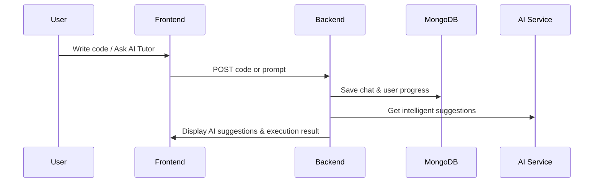

# 🚀 CobraAI - Intelligent Coding Companion [](https://choosealicense.com/licenses/mit/)


**CobraAI isn’t just a project — it’s your ultimate coding companion. Powering your learning journey with intelligent suggestions, adaptive guidance, and real-time execution.**  
Built with passion by **Harsh Pandey**.

## 📌 Table of Contents

- [Features](#-features)
- [Tech Stack](#-tech-stack)
- [System Flow](#-system-flow)
- [Installation](#-installation)
- [Usage Guide](#-usage-guide)
- [Screenshots](#-screenshots)
- [Deployment](#-deployment)
- [AI Tutor Integration](#-ai-tutor-integration)
- [Auto-Level Up System](#-auto-level-up-system)
- [Code Review Worker (Planned)](#-code-review-worker-planned)
- [Roadmap](#-roadmap)
- [License](#-license)
- [Contact](#-contact)

## ✨ Features

| Feature                     | Description                                                              |
| --------------------------- | ------------------------------------------------------------------------ |
| 🔐 **Authentication**       | Secure username-password system with persistent login                 |
| 💬 **Interactive Coding**   | Write HTML, CSS, JS, and Python code with live preview and execution  |
| 🤖 **AI Tutor**              | Personalized AI-powered coding guidance and suggestions               |
| 📚 **Code Execution**        | Run and preview HTML/CSS/JS code instantly in an iframe              |
| 🧠 **Adaptive Learning**    | User profile-based personalized suggestions and adaptive guidance     |
| 🏆 **Auto-Level Up System** | Automatically updates user level (Beginner, Intermediate, Advance)   |
| 📝 **Save & Load History**   | Persistent chat history saved to database for context               |
| ⚡ **Fast Compilation**       | Real-time execution powered by external APIs and backend workers       |
| 🎯 **Clean UI**             | Minimal and sleek interface for coding, preview, and chat             |

## 🛠 Tech Stack

**Frontend:**

- React.js (Vite)
- Tailwind CSS
- Axios
- React Router Dom
- Context API

**Backend:**

- Node.js
- Express.js
- MongoDB (Mongoose)
- JWT Authentication
- Google Gemini API for AI
- Piston API for Python Execution

## 🔁 System Flow



## 🧰 Installation

### 📁 Backend Setup

```bash
git clone https://github.com/201Harsh/CobraAI.git
cd CobraAI/Backend
npm install
cp .env
npm run dev
```

### 💻 Frontend Setup

```bash
cd ../Frontend
npm install
cp .env
npm run dev
```

## 🧑‍💻 Usage Guide

1. Register or Login
2. Interact with AI Tutor for coding guidance
3. Write and execute HTML/CSS/JS/Python code
4. Get intelligent code suggestions before running
5. Save and load your previous code sessions
6. See your learning level adapt automatically

## 🖼 Screenshots

> Coming soon...

## 🚀 Deployment

Deploy Frontend and Backend separately with appropriate environment variables (MongoDB URI, API Keys, etc.)

## 🤖 AI Tutor Integration

Uses Google Gemini API to provide adaptive coding suggestions and explanations based on user profile.

## 🔧 Auto-Level Up System

Automatically upgrades user's skill level (Beginner → Intermediate → Advance) based on usage patterns and learning progress.

## 🛣 Roadmap

- ✅ Live code editor for HTML/CSS/JS
- ✅ AI Tutor with persistent memory
- ✅ Auto-level adjustment system
- 🚧 Python code execution improvements
- 🚧 Code review worker system

## 📃 License

MIT License © 2025 Harsh Pandey

## 📮 Contact

- GitHub: https://github.com/201Harsh
- Instagram: https://www.instagram.com/201harshs/
- Email: support@endgamingai2@gmail.com
