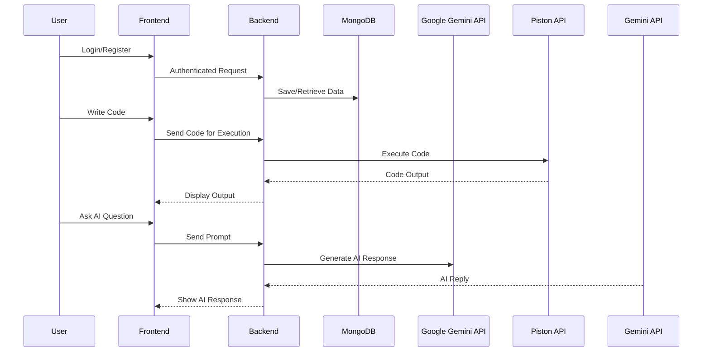
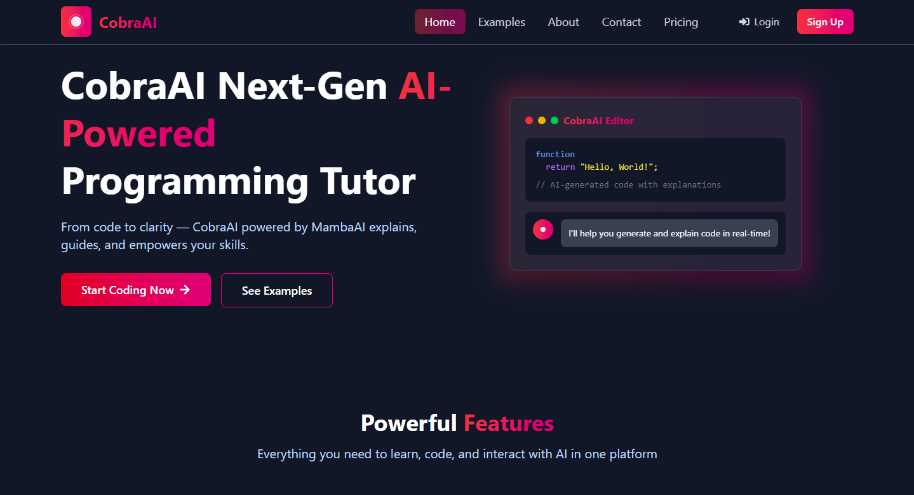
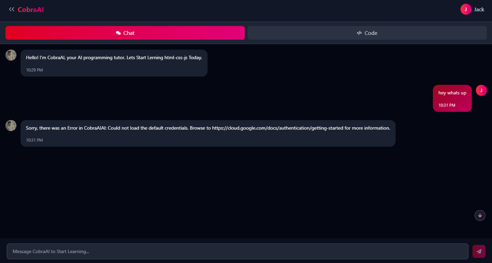
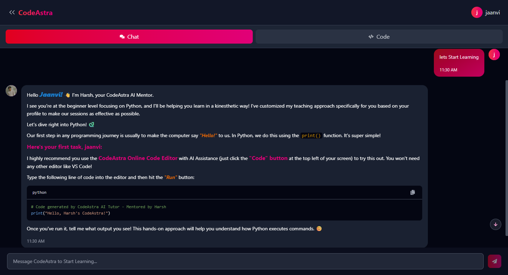

# 🌟 CodeAstra - Intelligent Code Compiler & AI Tutor [](https://choosealicense.com/licenses/mit/)


**CodeAstra** is a next-generation web platform combining an intelligent code compiler and an AI-powered tutor to help developers learn and execute code efficiently. Featuring code execution for frontend technologies (HTML, CSS, JS) and Python, smart AI suggestions, personalized adaptive learning, and persistent chat history — all wrapped in a modern, sleek interface.

[](https://reactjs.org)  
[](https://nodejs.org)  
[](https://www.mongodb.com)

---

## 📌 Table of Contents

- [✨ Features](#-features)
- [🛠 Tech Stack](#-tech-stack)
- [🚀 System Flow](#-system-flow)
- [🧰 Installation](#-installation)
- [👨‍💻 Usage Guide](#-usage-guide)
- [📸 Screenshots](#-screenshots)
- [⚡ AI Tutor Example](#-ai-tutor-example)
- [🎯 Roadmap](#-roadmap)
- [🤝 Contributing](#-contributing)
- [📜 License](#-license)
- [📮 Contact](#-contact)

---

## ✨ Features

| Feature                        | Description                                                                                         |
| ------------------------------ | --------------------------------------------------------------------------------------------------- |
| 💻 **HTML/CSS/JS Compiler**    | Execute and preview frontend code in real-time within the platform                                  |
| 🐍 **Python Code Execution**   | Execute Python code with standard input support                                                     |
| 🧠 **AI Tutor Assistant**      | Personalized adaptive AI tutor giving intelligent suggestions, code fixes, and guidance             |
| 💬 **Persistent Chat History** | Stores last user-AI interactions in database for context-aware learning                          |
| 🔐 **Authentication**          | Secure login and signup with JWT authentication                                                     |
| 🌱 **Auto Level Up System**    | Tracks user progress and automatically upgrades skill level from Beginner → Intermediate → Advanced |
| 🚀 **Modern UI/UX**            | Sleek interface powered by Tailwind CSS & Framer Motion animations                                  |
| 📄 **Code Review Worker**      | Background service to analyze submitted code for potential errors and improvements                  |

---

## 🛠 Tech Stack

**Frontend:**

- React.js (Vite)
- Tailwind CSS
- Axios
- Framer Motion
- Context API

**Backend:**

- Node.js
- Express.js
- MongoDB (Mongoose)
- JWT (Authentication)
- Google Gemini AI API for AI Tutor
- Piston API for Python Code Execution

---

## 🚀 System Flow



---

## 🧰 Installation

### 📦 Prerequisites

- Node.js v18+
- MongoDB Atlas or Local MongoDB
- (Optional) Google Gemini API Key

### 📁 Backend Setup

```bash
git clone https://github.com/201Harsh/CodeAstra.git
cd CodeAstra/Backend
npm install
cp .env
npm run dev
```

### 💻 Frontend Setup

```bash
cd ../Frontend
npm install
cp .env
npm run dev
```

---

## 👨‍💻 Usage Guide

1. Register and login securely
2. Write frontend code (HTML/CSS/JS) or Python in the provided editor
3. Press "Run" to compile code and view output in real-time
4. Ask questions in the AI Tutor section
5. View code suggestions, fixes, and educational insights
6. Chat history stores automatically with context
7. Your skill level (Beginner/Intermediate/Advanced) upgrades based on usage and performance

---

## 📸 Screenshots

> See the Screenshots Below

### Editor & AI Tutor Interface



### Real-Time Code Execution Output



### AI Tutor Chat Section



---

## ⚡ AI Tutor Example

> Example AI Suggestions

```text
[AI]: Great job! However, using `const` instead of `var` improves scoping and avoids accidental redeclarations.
[AI]: Consider breaking down your function into smaller reusable components for clarity.
[AI]: You forgot to close your `<div>` tag in line 10.
```

---

## 🤖 AI Tutor Integration

Uses Google Gemini API to provide adaptive coding suggestions and explanations based on user profile.

## 🔧 Auto-Level Up System

Automatically upgrades user's skill level (Beginner → Intermediate → Advance) based on usage patterns and learning progress.

---

## 🎯 Roadmap

### ✅ Completed

- ✅ Authentication System (JWT-based)
- ✅ Frontend HTML/CSS/JS Code Compiler
- ✅ Python Code Execution (Piston API)
- ✅ AI Tutor Integration (Google Gemini API)
- ✅ Persistent Chat History Storage
- ✅ Adaptive Leveling System
- ✅ User-Friendly Modern UI

### 🚧 Planned

- ⚡ Express & React Code Compiler
- 📊 Detailed Performance Dashboard
- 🧱 File Upload & Media Sharing
- 🔔 In-App Notifications
- 🌐 Internationalization (i18n)
- 🧪 Unit & Integration Testing

---

## 🤝 Contributing

Contributions are welcome!

1. Fork the repo
2. Clone locally
3. Create a new branch (`git checkout -b feature-name`)
4. Make your changes and commit (`git commit -m "Add feature"`)
5. Push and create a Pull Request

---

## 📜 License

```text
MIT License
Copyright (c) 2025 Harsh
Permission is hereby granted, free of charge, to any person obtaining a copy...
```

---

## 📮 Contact

- GitHub: [https://github.com/201Harsh](https://github.com/201Harsh)
- Instagram: [https://www.instagram.com/201harshs/](https://www.instagram.com/201harshs/)
- Email: support@endgamingai2@gmail.com

---

## 🚀 Final Thought

**CodeAstra isn’t just a project — it’s your ultimate coding companion. Powering your learning journey with intelligent suggestions, adaptive guidance, and real-time execution.**

# Made with ❤️ by Harsh
