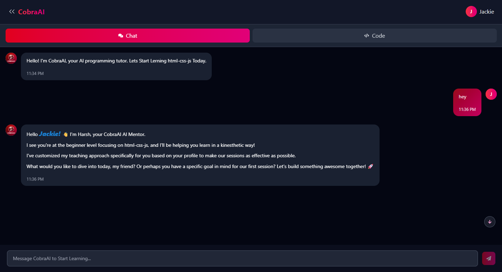

# 🌟 CobraAI — Next-Gen AI-Powered Coding Ecosystem

[](https://choosealicense.com/licenses/mit/)


**CobraAI** is a next-generation web platform combining an intelligent code compiler and an AI-powered tutor to help developers learn and execute code efficiently. Featuring code execution for frontend technologies (HTML, CSS, JS), Python, **Express.js runtime via WebContainer**, smart AI suggestions, personalized adaptive learning, and persistent chat history — all wrapped in a modern, sleek interface.

[](https://www.mongodb.com)
[](https://expressjs.com)
[](https://reactjs.org)  
[](https://nodejs.org)
[](https://webcontainers.io)

---

## 📌 Table of Contents

- [✨ Features](#-features)
- [🛠 Tech Stack](#-tech-stack)
- [🚀 System Flow](#-system-flow)
- [🧰 Installation](#-installation)
- [👨‍💻 Usage Guide](#-usage-guide)
- [📸 Screenshots](#-screenshots)
- [⚡ AI Tutor Example](#-ai-tutor-example)
- [🤖 AI Code Review](#-ai-code-review)
- [🎯 Roadmap](#-roadmap)
- [🤝 Contributing](#-contributing)
- [📜 License](#-license)
- [📮 Contact](#-contact)

---

## ✨ Features

| Feature                        | Description                                                                                         |
| ------------------------------ | --------------------------------------------------------------------------------------------------- |
| 💻 **HTML/CSS/JS Compiler**    | Execute and preview frontend code in real-time within the platform                                  |
| 🐍 **Python Code Execution**   | Execute Python code with standard input support                                                     |
| ⚡ **Express.js Runtime**      | Run full Express.js applications inside the browser using WebContainer                              |
| 🧠 **AI Tutor Assistant**      | Personalized adaptive AI tutor giving intelligent suggestions, code fixes, and guidance             |
| 🤖 **AI Code Review**          | Automated code reviews with style, correctness, security, performance and test suggestions          |
| 💬 **Persistent Chat History** | Stores last user-AI interactions in database for context-aware learning                             |
| 🔐 **Authentication**          | Secure login and signup with JWT authentication                                                     |
| 🌱 **Auto Level Up System**    | Tracks user progress and automatically upgrades skill level from Beginner → Intermediate → Advanced |
| 🚀 **Modern UI/UX**            | Sleek interface powered by Tailwind CSS & Framer Motion animations                                  |
| 📄 **Code Review Worker**      | Background service to analyze submitted code for potential errors and improvements                  |

---

## 🛠 Tech Stack

**Frontend:**

- React.js (Vite)
- Tailwind CSS
- Axios
- Framer Motion
- Context API

**Backend & Runtime:**

- Node.js
- Express.js
- MongoDB (Mongoose)
- JWT (Authentication)
- Google Gemini / LLM API for AI Tutor & Code Review
- Piston API for Python Code Execution
- **WebContainer API for Express.js Runtime inside Browser**

---

## 🚀 System Flow


---

## 🧰 Installation

### 📦 Prerequisites

- Node.js v18+
- MongoDB Atlas or Local MongoDB
- (Optional) Google Gemini / OpenAI API Key

### 📁 Backend Setup

```bash
git clone https://github.com/201Harsh/CobraAI.git
cd CobraAI/Backend
npm install
cp .env.example .env
# add required API keys and DB connection strings to .env
npm run dev
```

### 💻 Frontend Setup

```bash
cd ../Frontend
npm install
cp .env.example .env
# add required API keys and runtime flags
npm run dev
```

---

## 👨‍💻 Usage Guide

1. Register and login securely
2. Write frontend code (HTML/CSS/JS), Python, or Express.js in the editor
3. Press "Run" to compile code and view output in real-time
4. Express.js apps run fully inside the browser via WebContainer
5. Ask questions in the AI Tutor section
6. Request an **AI Code Review** for a file, snippet, or whole repo
7. View code suggestions, fixes, and educational insights
8. Apply suggested fixes automatically or copy patches into your editor
9. Chat history stores automatically with context
10. Your skill level (Beginner/Intermediate/Advanced) upgrades based on usage and performance

---

## 📸 Screenshots

> See the Screenshots Below

### Editor & AI Tutor Interface


### Real-Time Code Execution Output



### AI Tutor Chat Section


---

## ⚡ AI Tutor Example

> Example AI Suggestions

```text
[AI]: Great job! However, using `const` instead of `var` improves scoping and avoids accidental redeclarations.
[AI]: Consider breaking down your function into smaller reusable components for clarity.
[AI]: You forgot to close your `<div>` tag in line 10.
```

---

## 🤖 AI Code Review

CobraAI's **AI Code Review** is a dedicated feature and worker pipeline that inspects submitted code and returns structured, actionable feedback. It combines conventional static analysis tools with the power of large language models to produce human-friendly and machine-actionable reviews.

### How AI Code Review Works (Overview)

1. **Submission**: User submits a file, snippet, branch, or repository link for review. Meta-data (language, runtime, test command) is included.
2. **Pre-Processing**: The Code Review Worker runs language-specific linters, formatters, and static analyzers (e.g., ESLint, Prettier, Flake8, Bandit, SonarQube rules) to catch straightforward issues.
3. **Automated Tests**: If tests exist or are requested, the worker runs the test suite in an isolated environment (WebContainer or CI runner) and captures failures and traces.
4. **LLM-powered Analysis**: The worker creates a structured prompt including lint results, test failures, code excerpts, and repository metadata and sends it to the LLM (Google Gemini / OpenAI). The LLM performs:
   - Semantic bug detection (logical mistakes, edge cases)
   - Security & dependency issues (insecure patterns, outdated libs)
   - Performance suggestions (complexity hotspots, caching opportunities)
   - Maintainability and style guidance (naming, modularization, documentation)
   - Test suggestions and example test cases
5. **Patch Generation**: For many suggestions the worker can produce a git-style patch or specific code snippets that can be applied automatically or manually.
6. **Explainability**: Each suggestion includes: the _issue_, _severity_, _suggested fix_, _explanation_ (why it matters), and _confidence score_ so users can prioritize changes.
7. **Human-in-the-loop**: Users can accept/modify/reject fixes; maintainers can require manual approval before applying patches to protected branches.
8. **Privacy & Safety**: By default, private repo content is processed in your own backend (never sent to 3rd-party storage) and only the minimal context required is sent to the LLM service. Sensitive tokens and secrets are redacted before review. An audit log records review actions.

### AI Code Review Outputs

- **Inline comments** shown in the editor with line numbers and code excerpts.
- **Structured report** (JSON) that can be used to populate dashboards or integrate with CI.
- **Auto-fix patches** that apply Prettier/ESLint or suggested small edits.
- **Test suggestions & generated tests** to increase coverage.
- **Security advisories** with links to CVE references and recommended dependency upgrades.

### Example Review Flow (User experience)

1. User clicks **Request Code Review** and selects files/branch.
2. Worker runs linters & tests, then sends a consolidated prompt to the LLM.
3. User receives a review summary and can expand inline comments to see full context and auto-fix patch.
4. User applies fixes automatically or copies suggested snippets to their editor.
5. Review history is stored in the DB for future reference and learning statistics.

### How to Configure (Example environment variables)

```
CODE_REVIEW_ENABLED=true
LLM_PROVIDER=google_gemini
LLM_API_KEY=your_api_key_here
REDACT_SECRETS=true
ALLOW_AUTO_FIX=false
```

---

## ⚙️ Implementation Notes (Suggestions & Best Practices)

- Keep the code review worker sandboxed (WebContainer, Docker, or ephemeral CI) to avoid executing untrusted code on production hosts.
- Maintain a whitelist/blacklist of rules and configure severity levels per project.
- Use structured JSON outputs from the worker to integrate with dashboards and GitHub/GitLab check runs.
- Add rate-limits and size caps for repo submissions to prevent abuse and overuse of LLM credits.
- Provide an "explain in plain English" toggle for junior developers to receive simpler explanations.

---

---

## 🧩 Personalized Learning Styles

CobraAI adapts to your preferred **learning style** so that every learner gets the best personalized experience. You can select your mode of learning, and the AI tutor adjusts explanations, examples, and challenges accordingly.

### Available Learning Styles

| Style                         | Icon | Description                                                               | AI Response                                                                                      |
| ----------------------------- | ---- | ------------------------------------------------------------------------- | ------------------------------------------------------------------------------------------------ |
| 🎮 **Fun Play Learner**       | 🎮   | Learn through games, challenges, and interactive coding exercises         | AI will create coding games, challenges, and reward systems to make learning enjoyable           |
| 🤝 **Hands-on Learner**       | ✋   | Learn by doing, with practical examples and immediate practice            | AI will provide interactive coding environments, sandboxes, and immediate practice opportunities |
| 📖 **Story Mode Learner**     | 📖   | Learn through narratives, real-world scenarios, and contextual examples   | AI will frame concepts within stories, use case studies, and real-world application scenarios    |
| 🧭 **Explorer Learner**       | 🧭   | Learn through discovery, experimentation, and self-guided exploration     | AI will suggest learning paths, provide resources for exploration, and encourage experimentation |
| 🎧 **Sound Wave Learner**     | 🎧   | Learn through auditory explanations, podcasts, and verbal instructions    | AI will provide audio explanations, voice-based interactions, and mnemonic devices               |
| 🎨 **Visual Mind Learner**    | 🎨   | Learn through diagrams, charts, visualizations, and color-coded examples  | AI will create diagrams, flowcharts, visual code explanations, and color-highlighted examples    |
| 🏆 **Challenge Mode Learner** | 🏆   | Learn through problem-solving, coding challenges, and achievement systems | AI will provide progressively difficult challenges, coding problems, and achievement tracking    |
| 🧘 **Zen Mode Learner**       | 🧘   | Learn through calm, focused, step-by-step explanations without pressure   | AI will provide calm, structured, step-by-step guidance with mindfulness breaks                  |

### How It Works

1. **Select Style**: During onboarding or anytime in settings, pick your preferred learning style.
2. **Adaptive Content**: The AI tutor tailors examples, feedback, and challenges according to your style.
3. **Dynamic Switching**: You can switch learning styles on the fly to try different approaches.
4. **Progress Tracking**: CobraAI logs your learning style usage and shows which modes improve your retention and coding speed the most.

This ensures **every learner** — whether visual, auditory, hands-on, or gamified — has a smooth, personalized journey.

## 🎯 Roadmap

### ✅ Completed

- ✅ Authentication System (JWT-based)
- ✅ Frontend HTML/CSS/JS Code Compiler
- ✅ Python Code Execution (Piston API)
- ✅ Express.js Runtime using WebContainer
- ✅ AI Tutor Integration (Google Gemini API)
- ✅ Persistent Chat History Storage
- ✅ Adaptive Leveling System
- ✅ User-Friendly Modern UI

### 🚧 Planned

- 📊 Detailed Performance Dashboard
- 🧱 File Upload & Media Sharing
- 🔔 In-App Notifications
- 🌐 Internationalization (i18n)
- 🧪 Unit & Integration Testing
- 🔒 Advanced Security Scanning & Dependency Auto-Upgrade Suggestions

---

## 🤝 Contributing

Contributions are welcome!

1. Fork the repo
2. Clone locally
3. Create a new branch (`git checkout -b feature-name`)
4. Make your changes and commit (`git commit -m "Add feature"`)
5. Push and create a Pull Request

---

## 📜 License

```text
MIT License
Copyright (c) 2025 Harsh
Permission is hereby granted, free of charge, to any person obtaining a copy...
```

---

## 🌍 Live Demo

🔗 **[View Live App](https://CobraAI-ai.onrender.com/)**

---

## 📮 Contact

- GitHub: [https://github.com/201Harsh](https://github.com/201Harsh)
- Instagram: [https://www.instagram.com/201harshs/](https://www.instagram.com/201harshs/)
- Email: support@endgamingai2@gmail.com

---

## 🚀 Final Thought

**CobraAI isn’t just a project — it’s your ultimate coding companion. Powering your learning journey with intelligent suggestions, adaptive guidance, and real-time execution.**

# Made with ❤️ by Harsh
